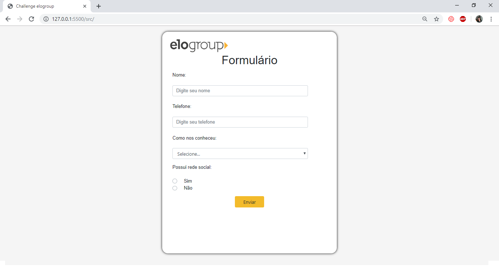
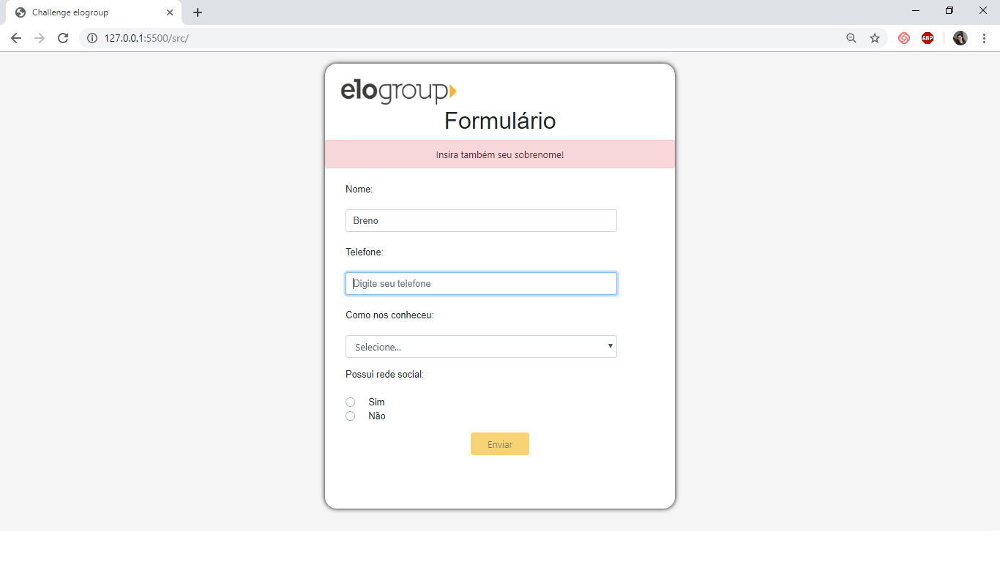
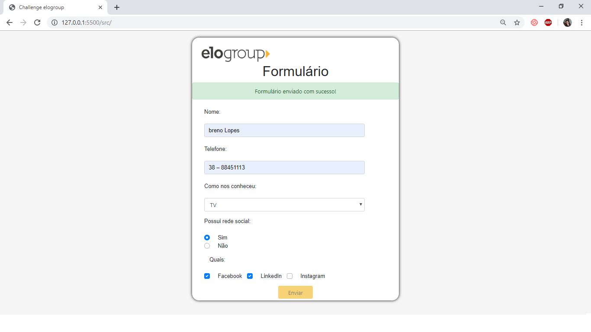

# Challenger-elo-group
Repositorio para compartilhar o desafio para processo seletivo da Elo Group. Trata- se de um simples formulário com validações,emissão de alerts e envio dos dados do formulario em formato json para a url: [localhost:8080](http://localhost:8080) através de metodo post.

Estrutura de pastas: 
- src: contém todos os arquivos de codigo do projeto;
    * assets: pasta que contém css, js, axios e jquery do projeto;
        - css: contém arquivo de estilização;
        - js:  contém códigos javascript;
        - axios: contém códigos da lib axios, responsável pelo envio do formulário via post;
        - jquery: contém códigos da lib jquery, responsável pela manipulção do html e DOM  do projeto; 
- serverTest: contém servidor criado com a framework express para testar o envio do formulário;
- bootstrap: contém arquivos de css e js para funcionamento do bootstrap.

